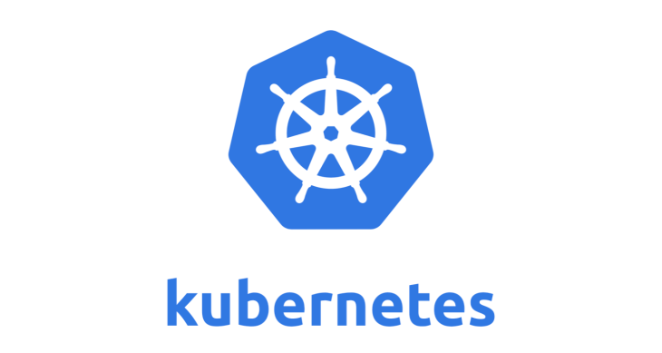
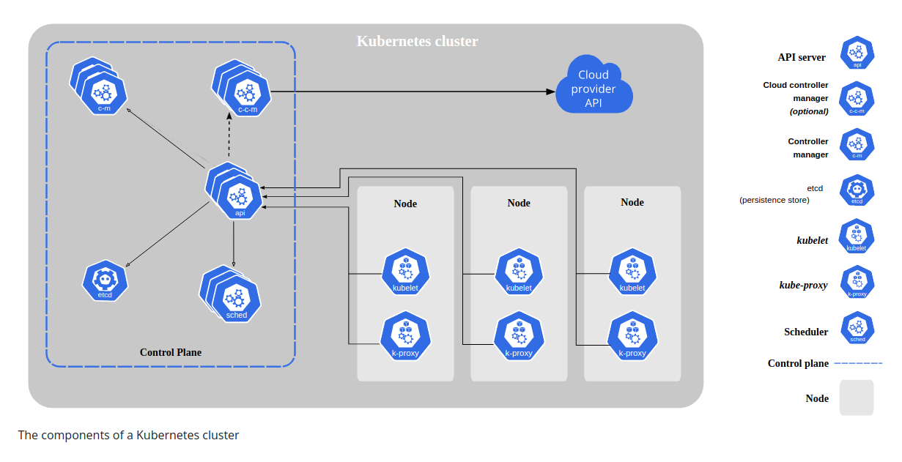

# Kubernetes

- Kubernetes: [https://kubernetes.io/](https://kubernetes.io/)
- Source: [https://github.com/thecyberbaby/Kubernetes](https://github.com/thecyberbaby/Kubernetes)

## Introduction

- Kubernetes, also known as K8s, is an open-source system for automating deployment, scaling, and management of containerized applications.

- It groups containers that make up an application into logical units for easy management and discovery. Kubernetes builds upon 15 years of experience of running production workloads at Google, combined with best-of-breed ideas and practices from the community.

- Designed on the same principles that allows Google to run billions of containers a week, Kubernetes can scale without increasing your ops team.

## Features

- Automated rollouts and rollbacks
  
- Storage orchestration 

- Automatic bin packing

- Self-healing

- Service discovery and load balancing

- Secret and configuration management

- Batch execution

- Horizontal scaling

- Designed for extensibility

## Installation

Please refer the official documentation for [installation](https://kubernetes.io/docs/tasks/tools/).

    

### Quick start

## Kubernetes Components

- Control Plane Components

  The control plane's components make global decisions about the cluster (for example, scheduling), as well as detecting and responding to cluster events (for example, starting up a new pod when a deployment's replicas field is unsatisfied).

- kube-apiserver 

  The API server is a component of the Kubernetes control plane that exposes the Kubernetes API. The API server is the front end for the Kubernetes control plane.

- etcd

  Consistent and highly-available key value store used as Kubernetes' backing store for all cluster data.
  If your Kubernetes cluster uses etcd as its backing store, make sure you have a back up plan for those data.

- kube-scheduler 

  Factors taken into account for scheduling decisions include: individual and collective resource requirements, hardware/software/policy constraints, affinity and anti-affinity specifications, data locality, inter-workload interference, and deadlines.

- kube-controller-manager 

  Control plane component that runs controller processes. Logically, each controller is a separate process, but to reduce complexity, they are all compiled into a single binary and run in a single process.

### Node Components 

 - kubelet
 - kube-proxy
 - container runtime

### Addons

 - DNS
 - Web UI (Dashboard)
 - Conatiner Resources Monitoring
 - Cluster-level Logging

 

    

## Workload Resources

 - Deployments
 - ReplicaSet
 ---------------------------------------
 - StatefulSet
 - DaemonSet
 - Jobs
 - TTL Controller for Finished Resourced
 - CronJob
 - ReplicationController

In this particular POC i we'll focus on `Deployments` and `ReplicaSet`.

For more feel free to peek into the official documentation [here](https://kubernetes.io/docs/concepts/workloads/controllers/)