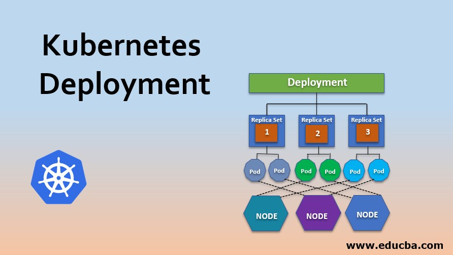
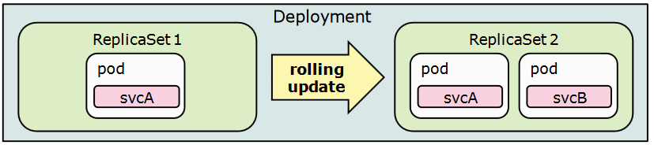

# Deployments and ReplicaSet

A Deployment provides declarative updates for `Pods` and `ReplicaSets`.

You describe a desired state in a Deployment, and the Deployment `Controller` changes the actual state to the desired state at a controlled rate. You can define Deployments to create new ReplicaSets, or to remove existing Deployments and adopt all their resources with new Deployments.

Note: Do not manage ReplicaSets owned by a Deployment. Consider opening an issue in the main Kubernetes repository if your use case is not covered below.

## Creating a Deployment 

    

The following is an example of a Deployment. It creates a ReplicaSet to bring up three nginx Pods:

	apiVersion: apps/v1
	kind: Deployment
	metadata:
	  name: nginx-deployment
	  labels:
	    app: nginx
	spec:
	  replicas: 3
	  selector:
	    matchLabels:
	      app: nginx
	  template:
	    metadata:
	      labels:
	        app: nginx
	    spec:
	      containers:
	      - name: nginx
	        image: nginx:1.14.2
	        ports:
	        - containerPort: 80

You can also download this `yaml` file from [here.](https://github.com/thecyberbaby/Kubernetes/blob/master/deployments/nginx-deployment.yaml)

In this example:

A Deployment named `nginx-deployment` is created, indicated by the `.metadata.name` field.

The Deployment creates three replicated Pods, indicated by the `.spec.replicas` field.

The `.spec.selector` field defines how the Deployment finds which Pods to manage. In this case, you select a label that is defined in the Pod template (app: nginx). However, more sophisticated selection rules are possible, as long as the Pod template itself satisfies the rule.

-----------------------------------------------------------

### Create the Deployment by running the following command:

	kubectl apply -f https://k8s.io/examples/controllers/nginx-deployment.yaml
	or
	kubectl apply -f nginx-deployment.yaml

### Run kubectl get deployments to check if the Deployment was created.

If the Deployment is still being created, the output is similar to the following:

	NAME               READY   UP-TO-DATE   AVAILABLE   AGE
	nginx-deployment   0/3     0            0           1s

after successfull creation output will be like

	nishant@i3:~$ kubectl get deployments
	NAME               READY   UP-TO-DATE   AVAILABLE   AGE
	nginx-deployment   3/3     3            3           41s

Check nodes and replicas

	nishant@i3:~/Desktop/Kubernetes$ kubectl get pods
	NAME                                READY   STATUS    RESTARTS   AGE
	nginx-deployment-66b6c48dd5-994wn   1/1     Running   0          77s
	nginx-deployment-66b6c48dd5-mbl8t   1/1     Running   0          77s
	nginx-deployment-66b6c48dd5-p68m9   1/1     Running   0          77s

	nishant@i3:~/Desktop/Kubernetes$ kubectl get rs
	nginx-deployment-75675f5897   3         3         3       18s

### To see the Deployment rollout status, run 

	kubectl rollout status deployment/nginx-deployment.

The output is similar to:

	Waiting for rollout to finish: 2 out of 3 new replicas have been updated...
	deployment "nginx-deployment" successfully rolled out

## Updating a Deployment 

    

Note: A Deployment's rollout is triggered if and only if the Deployment's Pod template (that is, `.spec.template`) is changed, for example if the labels or container images of the template are updated. Other updates, such as scaling the Deployment, do not trigger a rollout.

 - Let's update the nginx Pods to use the nginx:1.16.1 image instead of the nginx:1.14.2 image.

		kubectl set image deployment.v1.apps/nginx-deployment nginx=nginx:1.16.1
		
		#or use the following command:
		
		kubectl set image deployment/nginx-deployment nginx=nginx:1.16.1

The output is similar to:

		deployment.apps/nginx-deployment image updated

 - To see the rollout status, run:

		kubectl rollout status deployment/nginx-deployment

		#The output is similar to this:
		
		Waiting for rollout to finish: 2 out of 3 new replicas have been updated...
		
		#or
		
		deployment "nginx-deployment" successfully rolled out

Get more details on your updated Deployment:

- After the rollout succeeds, you can view the Deployment by running `kubectl get deployments`. The output is similar to this:

		NAME               READY   UP-TO-DATE   AVAILABLE   AGE
		nginx-deployment   3/3     3            3           36s

Run `kubectl get rs` to see that the Deployment updated the Pods by creating a new ReplicaSet and scaling it up to 3 replicas, as well as scaling down the old ReplicaSet to 0 replicas.

	kubectl get rs

The output is similar to this:

	NAME                          DESIRED   CURRENT   READY   AGE
	nginx-deployment-1564180365   3         3         3       6s
	nginx-deployment-2035384211   0         0         0       36s
	
Running get pods should now show only the new Pods:

	kubectl get pods

The output is similar to this:

	NAME                                READY     STATUS    RESTARTS   AGE
	nginx-deployment-1564180365-khku8   1/1       Running   0          14s
	nginx-deployment-1564180365-nacti   1/1       Running   0          14s
	nginx-deployment-1564180365-z9gth   1/1       Running   0          14s

### Next time you want to update these Pods, you only need to update the Deployment's Pod template again.

