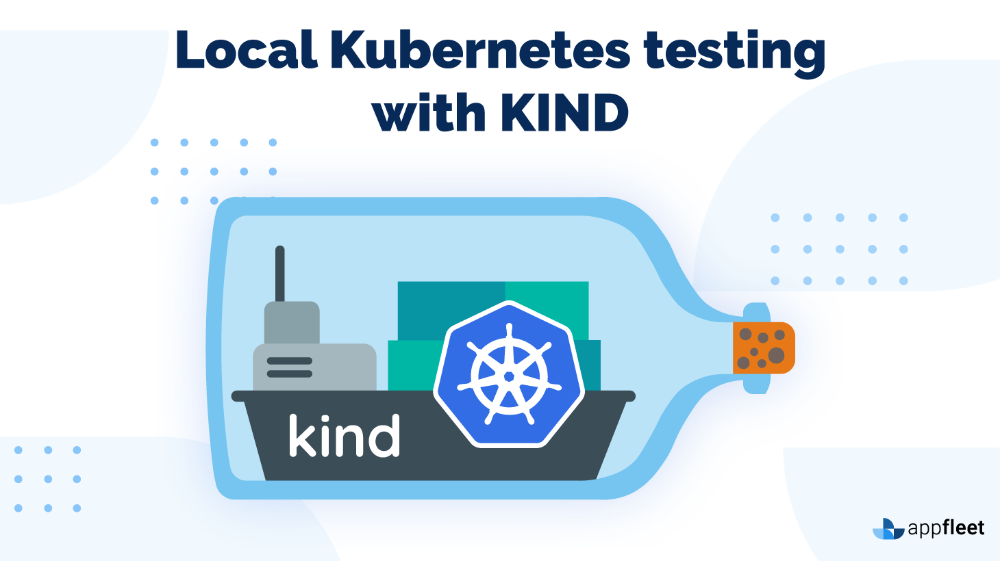
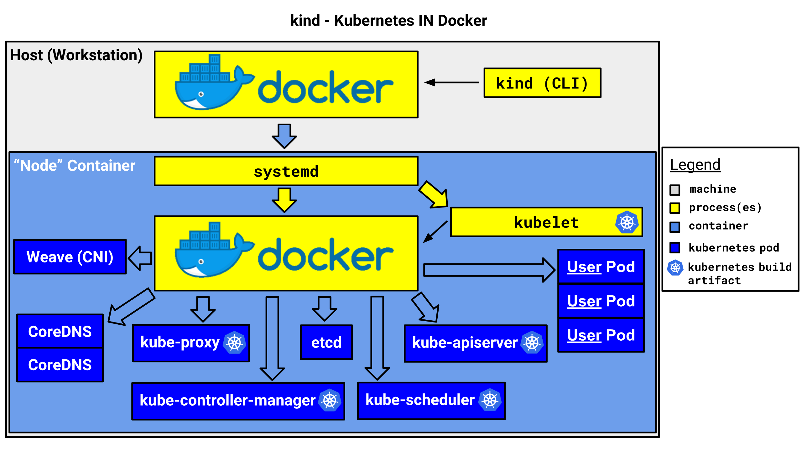

# Kubernetes - Kind

- Kubernetes: [https://kind.sigs.k8s.io/](https://kind.sigs.k8s.io/)
- Source: [https://github.com/thecyberbaby/Kubernetes](https://github.com/thecyberbaby/Kubernetes)

## Introduction

- kind is a tool for running local Kubernetes clusters using Docker container “nodes”.
- kind was primarily designed for testing Kubernetes itself, but may be used for local development or CI.

- kind is a tool for running local Kubernetes clusters using Docker container “nodes”.
- kind was primarily designed for testing Kubernetes itself, but may be used for local development or CI.

## Installation

- You can install kind with go get sigs.k8s.io/kind. 
This will put kind in $(go env GOPATH)/bin. You may need to add that directory to your $PATH as shown [here](https://golang.org/doc/code#GOPATH) 
if you encounter the error kind: command not found after installation.

- To use kind, you will also need to [install docker.](https://docs.docker.com/get-docker/)

    

### Start  your cluster

From a terminal with administrator access (but not logged in as root), run:

	sudo kind create cluster

	nishant@i3:~$ sudo kind create cluster
	[sudo] password for nishant: 
	Creating cluster "kind" ...
	 ✓ Ensuring node image (kindest/node:v1.21.1) 🖼
	 ✓ Preparing nodes 📦  
	 ✓ Writing configuration 📜 
	 ✓ Starting control-plane 🕹️ 
	 ✓ Installing CNI 🔌 
	 ✓ Installing StorageClass 💾 
	Set kubectl context to "kind-kind"
	You can now use your cluster with:

	kubectl cluster-info --context kind-kind

	Not sure what to do next? 😅  Check out https://kind.sigs.k8s.io/docs/user/quick-start/
	nishant@i3:~$ 

For delete cluster..

	sudo kind delete cluster	
	
	nishant@i3:~$ sudo kind delete cluster
	Deleting cluster "kind" ...
	nishant@i3:~$ 

### Loading an Image Into Your Cluster

Docker images can be loaded into your cluster nodes with:

	kind load docker-image my-custom-image-0 my-custom-image-1

Note: If using a named cluster you will need to specify the name of the cluster you wish to load the images into: `kind load docker-image my-custom-image-0 my-custom-image-1 --name kind-2`

### Known issues

- You may have problems interacting with your kind cluster if your client(s) are skewed too far from the kind node version. 
Kubernetes [only supports limited skew](https://kubernetes.io/releases/version-skew-policy/#supported-version-skew) between clients and the API server.

- This is a issue that frequently occurs when running kind alongside Docker For Mac.

- This problem is related to a bug in [docker on macOS](https://github.com/docker/for-mac/issues/3663)

    

### Unable to pull image

When using named KIND instances you may sometimes see your images failing to pull correctly on pods.
This will usually manifest itself with the following output when doing a kubectl describe pod my-pod.

	Failed to pull image "docker.io/my-custom-image:tag": rpc error: code = Unknown desc = failed to resolve image "docker.io/library/my-custom-image:tag": no available registry endpoint: pull access denied, repository does not exist or may require authorization: server message: insufficient_scope: authorization failed

if this image has been loaded onto your kind cluster using the command `kind load docker-image my-custom-image` then you have likely not provided the name parameter.

Re-run the command this time adding the `--name my-cluster-name` param:

`kind load docker-image my-custom-image --name my-cluster-name`

## In the end

Kind is another Kubernetes SIGs project but is quite different compared to minikube. As the name suggests it moves the cluster into Docker containers. This leads to a significantly faster startup speed compared to spawning VM.

Creating a cluster is very similar to minikube’s approach. Executing `kind create cluster`, playing the waiting game and afterwards you are good to go. By using different names (`--name`) kind allows you to create multiple instances in parallel.

One feature that I personally enjoy is the ability to load my local images directly into the cluster. This saves me a few extra steps of setting up a registry and pushing my image each and every time I want to try out my changes. With a simple `kind load docker-image my-app:latest` the image is available for use in my cluster. Very nice!

Thats it for this.